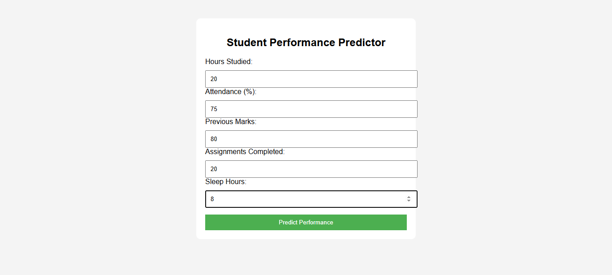
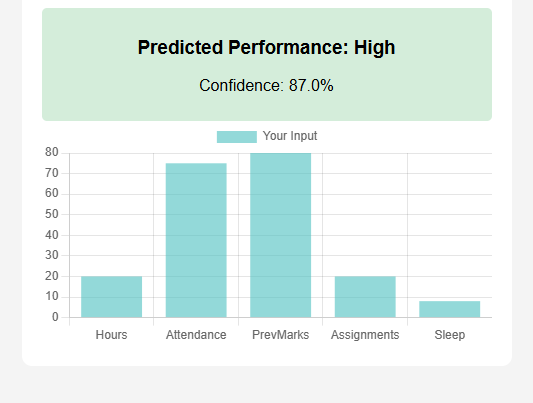

# Student Performance Predictor – ML Web App

## Overview
A professional and interactive web application to predict student performance based on key academic and lifestyle factors.  
Users can input study hours, attendance, previous marks, assignments completed, and sleep hours.  
The app predicts whether the performance will be **High, Medium, or Low** and provides a visual bar chart of the inputs.


## Features
- Predicts student performance: **High / Medium / Low**
- Dynamic user inputs via web form
- Visualizes inputs using **bar charts**
- Displays confidence/probability of prediction
- Color-coded result box for easy interpretation
- Fully responsive and beginner-friendly
- Easily deployable online (Render / Heroku)
- Built-in machine learning model (**RandomForestClassifier**)


## Screenshots
-Input Form

-Prediction



## Tech Stack
- Python 3
- Flask (Web Framework)
- NumPy, Pandas (Data handling)
- Scikit-learn (Machine Learning)
- Chart.js (Bar chart visualization)
- HTML / CSS (UI design)


## Installation

1. Clone the repository:
```bash
git clone https://github.com/heman315/student-performance-predictor.git